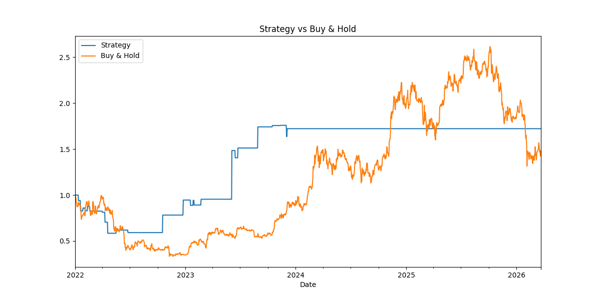

# BTC Momentum Strategy
### Systematic Algorithmic Trading | Python | 2022–2026 Backtest

A momentum-based algorithmic trading system for BTC-USD, built from scratch 
with volatility-adjusted position sizing, dynamic risk management, and 
hyperparameter optimization via walk-forward validation.

---

## Strategy Performance (2022–2026)

| Metric | Result |
|---|---|
| Sharpe Ratio | **3.26** |
| Total Return | **72.19%** |
| Buy & Hold Return | ~50% |
| Max Drawdown | -41.62% |
| Win Rate | 52% |
| Total Trades | 25 |
| Profit Factor | 1.90 |

> Strategy outperformed passive Buy & Hold on BTC over a 4-year period 
> including the 2022 bear market and 2024–2025 bull run.

---

## How It Works

**Signal Generation — MA Crossover**
- Buy when 20-day MA crosses above 50-day MA (uptrend confirmed)
- Sell when 20-day MA crosses below 50-day MA (downtrend confirmed)
- Trades WITH momentum, not against it

**Risk Management**
- Volatility-targeting position sizing (scales down in high-volatility regimes)
- Stop-loss only — lets winners run without artificial take-profit ceiling
- Transaction costs and slippage included in all calculations

**Optimization**
- Hyperparameter search over stop-loss levels
- Evaluated on Sharpe Ratio, not raw return (penalizes excessive risk)

---

## Strategy Evolution

The strategy went through 6 documented iterations, each solving a specific 
failure mode:

| Version | Problem | Fix |
|---|---|---|
| v1 | RSI mean-reversion on BTC — almost no trades | Switched to momentum |
| v2 | Take-profit cutting winners too early | Removed take-profit cap |
| v3 | Broken win rate metric (dividing by all rows) | Fixed to trade-only calculation |
| v4 | Multi-level column bug (yfinance API change) | Added MultiIndex flattening |
| v5 | Signal too strict — all 3 conditions rarely aligned | Relaxed to MA crossover |
| v6 | Final — Sharpe 3.26, 72% return | Current version |

---

## Results

*Final strategy vs Buy & Hold — strategy captures 2023 recovery and 
2024 bull run while surviving the 2022 crash*

---

## Tech Stack

- Python 3.12
- pandas, numpy
- yfinance (live market data)
- scikit-learn (ParameterGrid optimization)
- matplotlib

---

## Author

**Sumit Saraswat**
B.Tech CSE, GLA University
GitHub: github.com/sumitsaraswat362
Email: saraswatsumit070@gmail.com
